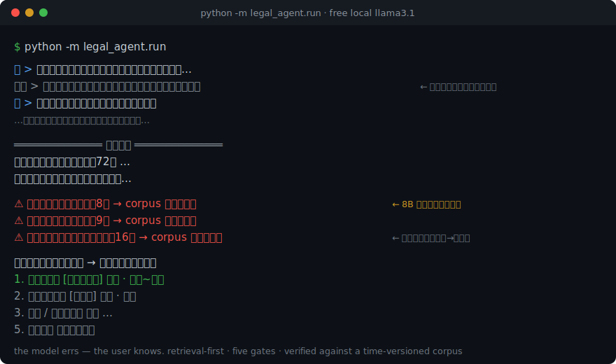
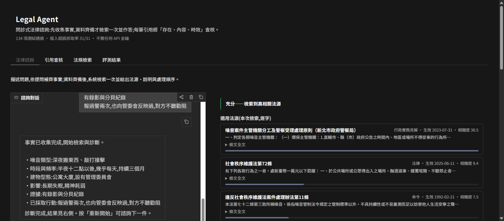

# Legal Agent

[](https://github.com/0Smallcat0/legal-agent/actions/workflows/ci.yml)
[](LICENSE)


> RAG systems cite sources that don't exist — and the fabrication reads exactly
> like the real thing. This repo is a working countermeasure: **every citation is
> machine-verified against a time-versioned corpus, and the guardrails are
> themselves tested by injecting errors** (43/43 seeded defects caught, 0 false
> positives). The bet is not "zero errors" — it's **errors you can see.**

A 2025 Stanford study measured *professional* legal AI tools hallucinating
17–33% of the time — funded products, with RAG. This project takes the hardest
version of the problem (CJK legal text, versioned statutes, high stakes) and
builds the discipline the numbers demand: the model may only cite what was
retrieved, and nothing reaches the user unchecked.

The reference corpus is **Taiwan (R.O.C.) law**, scoped to one scenario
(住宅噪音糾紛 / residential noise disputes) so every article is hand-verified.
The engine is **jurisdiction-agnostic** — swap the data, keep the gates.

---

## Three patterns you can reuse

Each stands alone; dependencies are stdlib + SQLite.

**1. Citation verification as code — not another LLM call.**
[`anti_hallucination/verifier.py`](legal_agent/anti_hallucination/verifier.py)
is a pure function that checks every citation in an answer on three axes:
*does the article exist* / *does the claim match its verbatim text* / *was it
in force at the relevant date*. It targets the RAG-era failure shape — citing a
**real** document but misreading it (transposed amounts, repealed versions,
typo'd statute names) — and on failure it attaches the verbatim source next to
the flagged claim instead of silently deleting. The three structural axes need
no LLM; an **optional** fourth axis (semantic consistency, for subject swaps
the lexical passes provably can't see) does inject one — off by default,
conservative on every failure path, and graded by the same mutation harness
before it's trusted.

**2. Mutation-test your guardrails.**
How do you know a verifier actually catches anything? Break answers on purpose.
[`evaluation/mutation.py`](legal_agent/evaluation/mutation.py) injects 43
seeded defects (fabricated statute, ghost article number, invented 之X
sub-article, wrong amount, flipped 以下/以上 direction word, out-of-force
citation) into otherwise-correct answers and measures the catch rate: **43/43
caught, 0/10 false positives on clean answers**. The two newest mutation types
each started at 0% — one exposed an amounts-only content match, the other a
regex that laundered invented 之X sub-articles into their real parent article.
Finding your own blind spots is precisely the point. A guardrail without this
number is decoration.

**3. Time-sliced retrieval for versioned sources.**
[`data/schema.sql`](legal_agent/data/schema.sql) keys statutes by
`(statute_id, article_no, effective_from)` — a *time slice*, not an article
number — and [`retrieval/retriever.py`](legal_agent/retrieval/retriever.py)
applies the point-in-time filter **before** ranking, so a repealed version is
never even a candidate. Answers *"for a dispute in 2023, which version
applied?"* Works for anything versioned: statutes, policies, contracts, specs.

These three sit inside a five-gate pipeline — retrieval-first prompting →
citation verifier → three-tier honesty (answer / "for reference only" / "not
in my corpus, ask a lawyer") → statute-vs-analysis separation →
anti-sycophancy (correct a wrong premise instead of agreeing with it). Full
design rationale in [`SPEC.md`](SPEC.md).

---

## Demo — the gates catching a real hallucination

<p align="center">
  
</p>

A live run against a **free local `llama3.1` (8B)** model. The user describes
the problem in plain language; the model drives the intake, then answers under
all five gates. Being a small model, it over-reached (it even typo'd 公寓→公寀)
— and the verifier caught every citation. **Every one was flagged.** That is
the entire thesis: *the model errs; the user knows.* A stronger model errs
less — the gates work identically regardless of backend.

**Try the same catch yourself** — interactive, no key needed:

```bash
python app.py   # Gradio demo: paste any "AI legal answer", watch the verifier flag it
```

<p align="center">
  
</p>

The first tab is the product: a clinic-style consultation — describe the
problem, answer the intake checklist, and on fact-completion the system
retrieves ONCE and returns the applicable statutes (verbatim,
relevance-ranked), the graded explanation, and the low-cost-first action
ladder, with citation verification as a quiet status line under the answer.
Everything deterministic runs with no model at all; a local Ollama adds the
分析研判 narrative. Remaining tabs: the citation-check tool (pre-filled with a
3-defect answer), the retrieval/time-slice explorer, and the measured numbers.
Free hosting recipe: [`docs/DEPLOY_SPACES.md`](docs/DEPLOY_SPACES.md).

---

## Measured results (local models, $0)

Full tables and method notes in [`evals/RESULTS.md`](evals/RESULTS.md); raw
per-run data in `evals/ablation_raw.json`. **Corpus note:** the table below
was measured on the original 11-article corpus; the corpus is now **2 561
articles across 11 everyday-law statutes** (official-XML import, hand-typed
golden sample matched character-for-character), the full-corpus mutation run
holds **9 833/9 833 caught, 0/2 560 false positives**, and golden-set
re-baselining is in progress — the honest details, including which numbers
moved and why, are in RESULTS.md §0. Headlines:

| what | number |
|---|---|
| Verifier catch rate on 33 seeded errors (fake statute / ghost article / wrong amount / flipped direction / out-of-force) | **33/33 (100%), 0/10 false positives** |
| Golden-set statute coverage (25 cases, llama3.1 8B, gated) | **84% pass+partial** (58% strict) |
| Honesty-tier accuracy / anti-sycophancy premise detection | **84% / 100%** |
| Out-of-scope questions refused instead of answered | **5/5** (the last leak fixed by a calibrated floor) |
| Bare model (no pipeline): memory-cited statutes traceable to a vetted source | **0–5%** (llama3.1 / qwen3) |
| Gated: every citation checked; small-model over-reach flagged inline with the verbatim article | **30–40% flagged** — *the model errs; the user knows* |

The golden set keeps earning its keep: it caught a real retriever defect while
being built (single-character function-word tokens matched everything → fixed),
and its score distribution calibrated the `insufficient` floor that closed the
last out-of-scope leak. The remaining tier misses are provably not separable by
any BM25 cutoff — quantified motivation for the hybrid-retrieval roadmap item.

---

## Quickstart

Requires **Python 3.10+**.

```bash
pip install -r requirements.txt

# build the SQLite schema + load the corpus (2 561 articles across 11 statutes
# of everyday law, imported from the official 全國法規資料庫 bulk XML)
python -c "from legal_agent.data.database import init_db; from legal_agent.config import DB_PATH; init_db(DB_PATH)"
python -m legal_agent.cli seed
python -m legal_agent.data.source_ingest corpus/moj_bulk_v1_proposal.json
python -m legal_agent.data.source_ingest corpus/noise_routing_proposal.json

python -m pytest -q          # 149 passing

# (optional) scale the corpus: parse the official 全國法規資料庫 bulk XML into a
# proposal file, review it by hand, then ingest through the same validated path
python -m legal_agent.data.moj_xml FalVMingLing.xml -o proposals.json --include 噪音管制法
python -m legal_agent.data.source_ingest proposals.json

# measure it (no key, no cost — see evals/RESULTS.md for current numbers)
python -m legal_agent.evaluation.mutation                               # verifier catch rate
python -m legal_agent.evaluation.golden_set evals/golden_v2.json  # Tier-1 golden set (30 cases)
python -m legal_agent.evaluation.calibrate evals/golden_v2.json   # threshold sweep

# talk to it (default backend: free local Ollama — https://ollama.com)
#   ollama pull llama3.1     # once
python -m legal_agent.run
```

Zero-setup alternative: set `LLM_PROVIDER = "manual"` in
[`legal_agent/config.py`](legal_agent/config.py) and the agent prints the
assembled prompt for you to paste into any chat — no local model, no API key.

---

## Architecture

Each layer maps to one package under `legal_agent/`:

| Layer | Package | What it does |
|---|---|---|
| Data | `data/` | time-sliced SQLite corpus + hand-entry / official-XML ingest tooling |
| Retrieval | `retrieval/` | BM25 (jieba + CJK bigrams); point-in-time filter before ranking |
| Anti-hallucination | `anti_hallucination/` | the five gates (verifier / honesty / structure / sycophancy) |
| Dialogue | `dialogue/` | four-stage clinic flow; LLM-driven + rule-based intake; solution ladder |
| Evaluation | `evaluation/` | golden-set runner + batch hallucination check + seeded-error mutation test + bare-vs-gated ablation + threshold calibration |

Two design choices worth naming. **The LLM sits behind a `str -> str` seam**
with three swappable backends — `manual` (free, paste into any chat), `ollama`
(free, local), `anthropic` (paid) — so the whole pipeline tests against a fake
model: no network, no key. **Retrieval fires exactly once per consultation**,
on the complete fact set after intake (multi-turn re-retrieval is the
documented cause of RAG degradation) — enforced by a test, not a convention.

---

## Status & roadmap

**MVP complete, tested, and measured.** The full pipeline — data → retrieval →
five gates → dialogue → solution ladder — is implemented and green (158 tests),
runs end-to-end for free on a local model, ships an interactive demo
(`app.py`), and carries a reproducible evaluation suite with published numbers
([`evals/RESULTS.md`](evals/RESULTS.md)).

Corpus growth is unblocked: a streaming importer
([`data/moj_xml.py`](legal_agent/data/moj_xml.py)) parses the official
全國法規資料庫 bulk XML into human-reviewed proposal files — the reviewer stays
in the loop, and laws the importer can't represent honestly (unknown tier,
missing dates, repealed history) are flagged, never guessed.

Scope today: one jurisdiction (Taiwan), a **2 561-article corpus covering 11
everyday-law statutes** (rent, labor, traffic, consumer, family-violence,
noise — imported from the official bulk XML, with the original hand-verified
11 articles as the character-for-character golden sample), one fully built
consultation scenario (noise); judgments have an importer
([`data/judicial_json.py`](legal_agent/data/judicial_json.py): 裁判書開放API
JSON → rows, citations extracted by the verifier's own grammar) but are
reference material only — not yet retrieval candidates. Roadmap — each item
motivated by a measured gap: **hybrid (dense) retrieval** (coverage 84%
pass+partial; the marginal/normal tier split is provably beyond any BM25
cutoff), judgment-aware answers, then more scenarios
and jurisdictions on the same engine.

---

## Disclaimer

A personal-use engineering experiment. **Not legal advice**, not a substitute
for a lawyer, and not affiliated with any government body. Reference statute
text is quoted verbatim from official public sources.

## License

[MIT](LICENSE).
