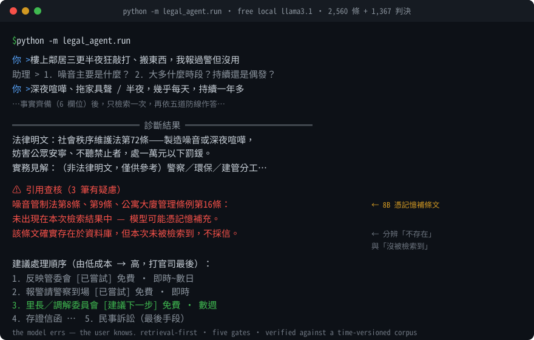

# Legal Agent

[](https://github.com/0Smallcat0/legal-agent/actions/workflows/ci.yml)
[](LICENSE)


> RAG systems cite sources that don't exist — and the fabrication reads exactly
> like the real thing. This repo is a working countermeasure: **every citation is
> machine-verified against a time-versioned corpus, and the guardrails are
> themselves tested by injecting errors** (10,435/10,435 seeded defects caught
> across the full corpus, 0 false positives). The bet is not "zero errors" —
> it's **errors you can see.**

A 2025 Stanford study measured *professional* legal AI tools hallucinating
17–33% of the time — funded products, with RAG. This project takes the hardest
version of the problem (CJK legal text, versioned statutes, high stakes) and
builds the discipline the numbers demand: the model may only cite what was
retrieved, and nothing reaches the user unchecked.

The reference corpus is **Taiwan (R.O.C.) law** — 2 560 articles across 11
everyday-law statutes (rent, labour, consumer, traffic, family violence,
noise…), imported from the official bulk XML and validated against a
hand-typed golden sample, plus **1 367 real court judgments** as reference
material. The engine is **jurisdiction-agnostic** — swap the data, keep the
gates.

---

## Three patterns you can reuse

Each stands alone; dependencies are stdlib + SQLite.

**1. Citation verification as code — not another LLM call.**
[`anti_hallucination/verifier.py`](legal_agent/anti_hallucination/verifier.py)
is a pure function that checks every citation in an answer on three axes:
*does the article exist* / *does the claim match its verbatim text* / *was it
in force at the relevant date*. It targets the RAG-era failure shape — citing a
**real** document but misreading it (transposed amounts, repealed versions,
typo'd statute names) — and on failure it attaches the verbatim source next to
the flagged claim instead of silently deleting. The three structural axes need
no LLM; an **optional** fourth axis (semantic consistency, for subject swaps
the lexical passes provably can't see) does inject one — off by default,
conservative on every failure path, and graded by the same mutation harness
before it's trusted.

**2. Mutation-test your guardrails.**
How do you know a verifier actually catches anything? Break answers on purpose.
[`evaluation/mutation.py`](legal_agent/evaluation/mutation.py) injects seeded
defects (fabricated statute, ghost article number, invented 之X sub-article,
wrong amount, flipped 以下/以上 direction word, swapped period/day-count,
out-of-force citation) into otherwise-correct answers over every article in
the corpus and measures the catch rate: **10,435/10,435 caught, 0/2,560 false
positives on clean answers**. Three mutation types each started at 0% — one
exposed an amounts-only content match, one a regex that laundered invented
之X sub-articles into their real parent article, and the newest a
period-blindness (七日 claimed as 十四日: 0/602, then 602/602 the same day) —
and a 2026-07 re-verification run caught the harness itself assuming
single-version articles (a capped historical slice legitimately covers "the
day before the current version"; the mutation now dates its citation before
the article's *earliest* slice). Finding your own blind spots is precisely
the point. A guardrail without this number is decoration.

**3. Time-sliced retrieval for versioned sources.**
[`data/schema.sql`](legal_agent/data/schema.sql) keys statutes by
`(statute_id, article_no, effective_from)` — a *time slice*, not an article
number — and [`retrieval/retriever.py`](legal_agent/retrieval/retriever.py)
applies the point-in-time filter **before** ranking, so a repealed version is
never even a candidate. Answers *"for a dispute in 2023, which version
applied?"* Works for anything versioned: statutes, policies, contracts, specs.

These three sit inside a five-gate pipeline — retrieval-first prompting →
citation verifier → three-tier honesty (answer / "for reference only" / "not
in my corpus, ask a lawyer") → statute-vs-analysis separation →
anti-sycophancy (correct a wrong premise instead of agreeing with it). Full
design rationale in [`SPEC.md`](SPEC.md).

---

## Demo — the gates catching a real hallucination

<p align="center">
  
</p>

A real run against a **free local `llama3.1` (8B)** model, transcribed from
its actual terminal output. The user describes the problem in plain language,
the intake collects the facts, and retrieval fires once. The 8B model then
reached past what was retrieved and cited three more articles from memory —
and all three were flagged, each with the reason spelled out: *the article
does exist in the database, but it was not retrieved this time, so this
citation is not accepted.* That distinction matters. A verifier that says
「查無此法源」 about an article that plainly exists is lying in the other
direction; this one separates **fabricated** from **un-retrieved**. That is
the entire thesis: *the model errs; the user knows.* A stronger model errs
less — the gates work identically regardless of backend.

**Try the same catch yourself** — interactive, no key needed:

```bash
python app.py   # Gradio demo: paste any "AI legal answer", watch the verifier flag it
```

<p align="center">
  
</p>

<sub>A real consultation, screenshotted live. Read the two panels together: the 8B
model's prose (marked 模型推論) waves 民法§18/§195 away as <em>「似乎與噪音問題無
直接關係」</em> — and directly beneath it the deterministic layer lists three actual
judgments decided under those very articles, one awarding 2 150 000–5 134 300 元.
The weakest component is the model; the parts that must be right are not left to it.</sub>

The first tab is the product: a clinic-style consultation — describe the
problem, answer the intake checklist, and on fact-completion the system
retrieves ONCE and returns the applicable statutes (verbatim,
relevance-ranked), the graded explanation, the low-cost-first action ladder,
and **the judgments that cite those same articles, with what the court
actually ordered paid** — read verbatim from each judgment's 主文, rendered
code-side so the model can never invent a case number. Citation verification
runs as a quiet status line under the answer. Everything deterministic runs
with no model at all; a local Ollama adds the 分析研判 narrative. Remaining
tabs: the citation-check tool (pre-filled with an answer whose defects the
verifier flags — and one correct citation it must let through), the
retrieval/time-slice explorer, and the measured numbers. Free hosting recipe:
[`docs/DEPLOY_SPACES.md`](docs/DEPLOY_SPACES.md).

---

## Measured results (local models, $0)

Full tables and method notes in [`evals/RESULTS.md`](evals/RESULTS.md); raw
per-run data in `evals/ablation_raw.json`. Every number below is reproducible
with the commands in Quickstart — no key, no cost. RESULTS.md records which
numbers moved when the corpus grew from 11 articles to 2 560, and why some of
them moved *down*.

| what | number |
|---|---|
| Verifier catch rate, seeded errors over **every article** (fake statute / ghost article / ghost 之X / wrong amount / flipped direction / swapped period / out-of-force) | **10 435/10 435 (100%), 0/2 560 false positives** |
| Golden-set statute coverage (30 cases, llama3.1 8B, gated, hybrid retrieval) | **100% pass+partial** (73% strict, 0 misses) |
| Retrieval recall on nine problems typed as people actually type them (hit@8) | **19/20 (95%)** — the first six went 7/14 → 12/14 in the same pass |
| Honesty-tier accuracy / anti-sycophancy premise detection | **90% (27/30) / 100% (30/30)** ³ |
| Reference judgments surfaced beside the answer (counted, never scored) | **11/30 cases**, 10 carrying a 主文 award figure ² |
| Bare model (no pipeline): memory-cited statutes traceable to a vetted source | **0–5%** (llama3.1 / qwen3) ¹ |
| Gated: every citation checked; small-model over-reach flagged inline with the verbatim article | **30–40% flagged** — *the model errs; the user knows* ¹ |

¹ The two ablation rows were measured on the original 11-article corpus and
have not been re-run at v2 scale; every other row is current.

² That row went *down* (from 21/30) on purpose. Judgments are now joined on the
articles the answer actually cites, not on the whole retrieved window — which is
what stopped a 本票 case appearing under a noise question. Precision up, coverage
halved; both halves of the trade are on the table.

³ This row read **77%** until 2026-07-25, and the explanation printed here was
wrong. It said out-of-scope detection was intrinsically harder at v2 scale. The
real cause: the `insufficient` floor was calibrated at 6.0 on the 11-article
corpus (top scores 4–42) and never revisited while corpus v2 pushed the same
scores to 30–330, so every out-of-scope question cleared it by 5×. Live
consequence, found by using the thing: 「虛擬貨幣獲利怎麼課稅」 was answered with
中華民國刑法§196 (行使偽造貨幣). Recalibrating both thresholds (floor 70 / marginal
106, swept — the sweep used to hold the floor fixed, which is why the harness
was blind too) gives 90%. The three remaining misses are marginal-vs-normal,
where the score ranges genuinely overlap; that one *is* a signal problem.
See [RESULTS.md §7](evals/RESULTS.md).

The golden set keeps earning its keep: it caught a real retriever defect while
being built (single-character function-word tokens matched everything → fixed),
and its score distribution calibrated the `insufficient` floor — twice, the
second time because using the product exposed the first calibration as stale.
The remaining tier misses are provably not separable by any BM25 cutoff (the
marginal and normal score ranges overlap), and hybrid retrieval — which shipped —
did not close that gap either: bge-m3 cosine was measured as a candidate
insufficiency signal and interleaves the same way.

---

## Quickstart

Requires **Python 3.10+**.

```bash
pip install -r requirements.txt

# build the SQLite schema + load the corpus (2 560 articles across 11 statutes
# of everyday law, imported from the official 全國法規資料庫 bulk XML, plus a
# police routing note and one capped historical slice)
python -c "from legal_agent.data.database import init_db; from legal_agent.config import DB_PATH; init_db(DB_PATH)"
python -m legal_agent.cli seed
python -m legal_agent.data.source_ingest corpus/moj_bulk_v1_proposal.json
python -m legal_agent.data.source_ingest corpus/noise_routing_proposal.json

python -m pytest -q          # 200 passing

# (optional) scale the corpus: parse the official 全國法規資料庫 bulk XML into a
# proposal file, review it by hand, then ingest through the same validated path
python -m legal_agent.data.moj_xml FalVMingLing.xml -o proposals.json --include 噪音管制法
python -m legal_agent.data.source_ingest proposals.json

# (optional) reference judgments. Needs a free account at
# opendata.judicial.gov.tw in a gitignored .env (JUDICIAL_USER/JUDICIAL_PASSWORD).
# Two constraints come from the API itself, not from us: it serves ONLY 00:00-06:00,
# and each call returns the change list of the day SEVEN DAYS AGO — so the
# judgment corpus accumulates night by night rather than downloading in bulk.
python -m legal_agent.data.judicial_api --limit 200

# measure it (no key, no cost — see evals/RESULTS.md for current numbers)
python -m legal_agent.evaluation.mutation                               # verifier catch rate
python -m legal_agent.evaluation.golden_set evals/golden_v2.json  # Tier-1 golden set (30 cases)
python -m legal_agent.evaluation.calibrate evals/golden_v2.json   # threshold sweep
python -m legal_agent.evaluation.real_recall                      # six lived sessions (retrieval only, no model)

# talk to it (default backend: free local Ollama — https://ollama.com)
#   ollama pull llama3.1     # once
python -m legal_agent.run
```

Zero-setup alternative: set `LLM_PROVIDER = "manual"` in
[`legal_agent/config.py`](legal_agent/config.py) and the agent prints the
assembled prompt for you to paste into any chat — no local model, no API key.

---

## Architecture

Each layer maps to one package under `legal_agent/`:

| Layer | Package | What it does |
|---|---|---|
| Data | `data/` | time-sliced SQLite corpus + hand-entry / official-XML ingest (single-open-slice guard) + 裁判書API harvester and verbatim 主文 reader |
| Retrieval | `retrieval/` | hybrid: BM25 (jieba + CJK bigrams) + optional local bge-m3 dense via RRF with measured reserved seats; 口語→法條語彙 query expansion; point-in-time filter before ranking; reference-judgment join |
| Anti-hallucination | `anti_hallucination/` | the five gates (verifier / honesty / structure / sycophancy) |
| Dialogue | `dialogue/` | four-stage clinic flow; LLM-driven + rule-based intake; solution ladder |
| Evaluation | `evaluation/` | golden-set runner + batch hallucination check + seeded-error mutation test + bare-vs-gated ablation + threshold calibration |

Two design choices worth naming. **The LLM sits behind a `str -> str` seam**
with three swappable backends — `manual` (free, paste into any chat), `ollama`
(free, local), `anthropic` (paid) — so the whole pipeline tests against a fake
model: no network, no key. **Retrieval fires exactly once per consultation**,
on the complete fact set after intake (multi-turn re-retrieval is the
documented cause of RAG degradation) — enforced by a test, not a convention.

---

## Status & roadmap

**MVP complete, tested, and measured.** The full pipeline — data → retrieval →
five gates → dialogue → solution ladder — is implemented and green (232 tests),
runs end-to-end for free on a local model, ships an interactive demo
(`app.py`), and carries a reproducible evaluation suite with published numbers
([`evals/RESULTS.md`](evals/RESULTS.md)).

Corpus growth is unblocked: a streaming importer
([`data/moj_xml.py`](legal_agent/data/moj_xml.py)) parses the official
全國法規資料庫 bulk XML into human-reviewed proposal files — the reviewer stays
in the loop, and laws the importer can't represent honestly (unknown tier,
missing dates, repealed history) are flagged, never guessed.

Scope today: one jurisdiction (Taiwan), a **2 560-article corpus covering 11
everyday-law statutes** plus a police routing note and its first capped
historical slice (rent, labor, traffic, consumer, family-violence,
noise — imported from the official bulk XML, with the original hand-verified
11 articles as the character-for-character golden sample), one fully built
consultation scenario (noise) with a generic clinic flow — intake checklist,
retrieval, low-cost-first action ladder — covering everything else; and
**1 367 real court judgments** harvested from the 裁判書開放API
([`data/judicial_api.py`](legal_agent/data/judicial_api.py) → the same
importer, citations extracted by the verifier's own grammar). Judgments stay
REFERENCE tier — never retrieval candidates, never citable law — and surface
only through a deterministic JOIN on the articles the pipeline already
retrieved ([`retrieval/judgments.py`](legal_agent/retrieval/judgments.py)),
carrying the award figure read verbatim from the judgment's own 主文
([`data/judgment_text.py`](legal_agent/data/judgment_text.py); 爭點/裁判要旨
stay NULL — summarising reasoning is an NLP task this project will not fake).
The block is rendered code-side, so the model can never invent a case number.
Coverage and its gaps are published, not assumed: RESULTS §5. Roadmap — each item
motivated by a measured gap: **hybrid retrieval + 口語→法條語彙 expansion
shipped** (golden-v2 coverage 65% → 88% → 96% pass+partial — the last jump
came from joining the user's ORIGINAL ask into the retrieval query: distilled
fact fields drop remedy vocabulary like 慰撫金/賠償, and those are the user's
own words, exactly what the inclusion rule wants — then a measured
reserved-seat rule let the dense channel's top-3 crack RRF's dual-list
bonus, strict 62% → 69%, the seat count swept not guessed; honesty tier
untouched; the embedding model was picked by an exam that rejected
nomic-embed-text, and the expansion table's first design was reverted when
it was measured manufacturing false matches), next: more historical statute
versions — the corpus carries its first (a 1992 slice capped when its 2020
successor record took over, guarded by an ingest rule that refuses two open
versions of the same article) — judgment-aware answers, then more scenarios
and jurisdictions on the same engine.

---

## Disclaimer

A personal-use engineering experiment. **Not legal advice**, not a substitute
for a lawyer, and not affiliated with any government body. Reference statute
text is quoted verbatim from official public sources.

## License

[MIT](LICENSE).
