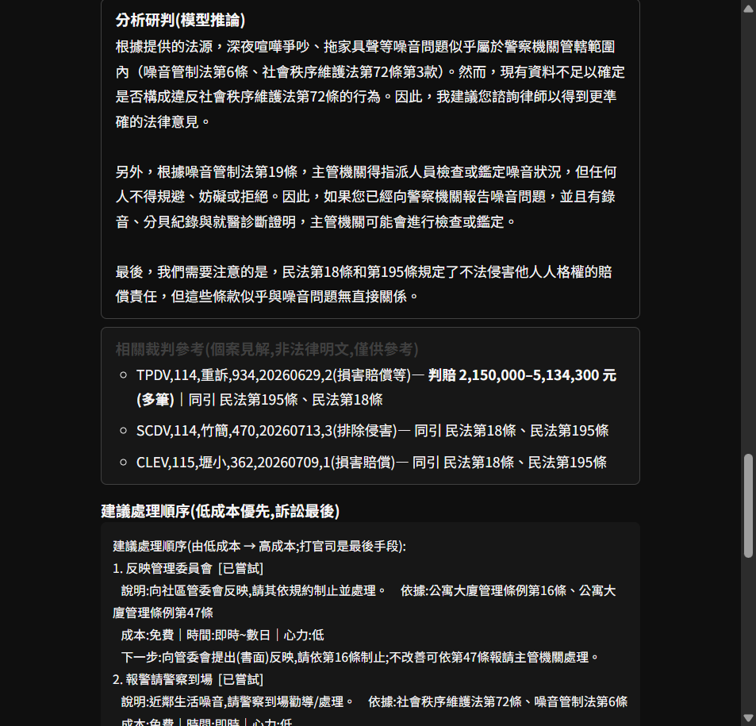

# Legal Agent

[](https://github.com/0Smallcat0/legal-agent/actions/workflows/ci.yml)
[](LICENSE)


[](https://huggingface.co/spaces/NoirOAO/legal-agent-demo)

**A RAG pipeline where every citation is checked by code, and the checker is
itself graded by planting errors in correct answers: 11,904/11,904 caught,
0 false positives.**

The usual defence against a hallucinated citation is a better prompt. This one
is a separate program that runs after the model and compares each citation
against the source corpus — does the article exist, does the quote match, was it
in force. The interesting part is not that the checker exists; it is that its
recall is a *measured number* rather than a claim, because errors are seeded
into otherwise-correct answers across the whole corpus and it has to catch them.

Everything that must be right is decided by code, not by the model: retrieval,
the citation check, the confidence tier, the deadline quotes, the action ladder.
The model writes the prose. **The whole pipeline runs with no model at all**,
which is also how it is tested — no network, no API key.

**[Try it without installing anything](https://huggingface.co/spaces/NoirOAO/legal-agent-demo)** —
the 引用查核 tab ships a pre-filled broken answer, so the whole story takes about
thirty seconds to check for yourself.

```bash
pip install .                     # no torch, no GPU; the corpus ships inside
```

```python
import legal_agent

for r in legal_agent.verify("依社會秩序維護法第72條,深夜喧嘩可處新臺幣六萬元以下罰鍰。"):
    print(r.flagged, r.reason)
# True  主張金額 [60000] 元未見於條文(條文金額 [10000])
```

That is the whole setup. The database builds itself from the corpus inside the
package on first call — no clone, no key, no model, no network. `verify` is pure
Python, so it cannot be argued out of a verdict. Pass `as_of="2024-06-01"` to
check the law as it stood on a date rather than today.

To run the demo from a clone instead:

```bash
pip install .[demo] && python app.py
```

The worked example is Taiwan law: 2,922 articles across 16 everyday statutes and
386 real court judgments, all shipped in the repo, so a fresh clone reproduces
every number below.

<p align="center">
  
</p>

<sub>The 8B model calls 民法§18/§195 irrelevant; right below it, three real
judgments decided under those very articles — one awarding 2,150,000–5,134,300
元, read verbatim from its 主文. The weakest part is the model; the parts that
must be right are not left to it.</sub>

## Measured, reproducible

| | |
|---|---|
| seeded defects caught (whole corpus) | **11,904/11,904, 0 false positives** |
| statute coverage, 32-case golden set | **100% pass+partial, 0 miss** (73% strict) |
| retrieval recall, real user wording | **348/356**, 5.9 unexpected articles per session |
| honesty tier / wrong-premise detection | **91% / 100%** |
| out-of-scope refused / in-scope falsely refused | **18/20 · 2/15** — both directions, because only measuring the first hid the second |
| deadlines quoted from the retrieved articles | **69/168 sessions** |
| first reference judgment states an awarded sum | **50/60 sessions** |
| that judgment is the same KIND of dispute as the question | **51/88**, and 58/146 carry a 案由 too generic to tell |
| first action names the reader's own documents | **83/168 sessions** |
| 存證信函 template, law quoted verbatim | **168/168 sessions** |
| articles on the page the model skipped | **8 → 18 of 21 expected** |

```bash
python -m legal_agent.evaluation.mutation                          # catch rate
python -m legal_agent.evaluation.golden_set evals/golden_v2.json   # golden set
python -m legal_agent.evaluation.real_recall                       # lived sessions
python -m legal_agent.evaluation.judgment_relevance                # reference tier
```

**Two of those rows need a second half a plain install does not have.** The
retriever is BM25 plus a hand-written vocabulary table plus optional bge-m3
embeddings, and the embeddings need a local index that is built rather than
shipped — it is derived from your corpus and it is ~12 MB of floats. Straight
after `pip install .` the retrieval half is lexical only: **recall 320/356
rather than 348/356**, measured. To reach the published figure:

```bash
ollama pull bge-m3                        # ~1.2 GB, once
python -m legal_agent.retrieval.dense     # builds the index beside your corpus
```

The verifier, the corpus, the honesty tier, the ladder and the 存證信函 template
never touch it and are unaffected. `real_recall` now prints whether the dense
half actually participated, so a number measured without it says so.

## Three things you can lift

Each is self-contained, with no Taiwan-specific logic worth speaking of:

- **[citation verifier](legal_agent/anti_hallucination/verifier.py)** — pure
  code, no model. Extracts citations from generated text and checks existence,
  content match, and in-force date against the corpus.
- **[mutation-tested guardrails](legal_agent/evaluation/mutation.py)** — the
  harness that grades the verifier by seeding defects. This is the piece most
  RAG projects are missing: a number for how much your safety net actually
  catches.
- **[time-sliced retrieval](legal_agent/retrieval/retriever.py)** — filters by
  point-in-time validity *before* ranking, so a repealed version cannot be
  retrieved and then explained away.

## Design notes worth the detour

- **Retrieval fires exactly once**, on the complete fact set after intake.
  Multi-turn re-retrieval is the documented cause of RAG degradation; here it is
  enforced by a test, not a convention.
- **The model sits behind a `str -> str` seam** with three swappable backends —
  `manual` (paste into any chat), `ollama` (local, the default), `anthropic`
  (paid). Pick one with `LEGAL_AGENT_PROVIDER=manual`, no source edit: measured
  on a clean venv, that was the only step in the documented path that left a
  first-time reader stuck, because `pip install` puts `config.py` in
  site-packages. **Swapping the model is measured, not assumed**: llama3.1:8B
  and qwen3:4b score identically on the golden set — pass 19 / partial 7 /
  miss 0, tier 29/32, premise 32/32 — because those are decided by retrieval and
  by code. The model changes the prose and nothing that is scored.
- **Judgments are reference tier**, never retrieval candidates and never citable
  law. They reach a page only through a deterministic join on articles the
  pipeline already retrieved, with the award figure read verbatim from the 主文.

[SPEC.md](SPEC.md) design · [RESULTS.md](evals/RESULTS.md) every number, the
method behind it, and the ones that went down ·
[CONTRIBUTING.md](CONTRIBUTING.md) the bar a change has to clear ·
[AGENTS.md](AGENTS.md) the same bar plus the measurement traps, for coding agents ·
[DEPLOY_SPACES.md](docs/DEPLOY_SPACES.md) hosting

**Found a wrong answer?** That is the most useful thing you can send — the
[issue template](.github/ISSUE_TEMPLATE/wrong-answer.yml) asks for the wording
you actually typed, which is how all 168 stored regression sessions began.

Personal engineering experiment, **not legal advice**. [MIT](LICENSE).
